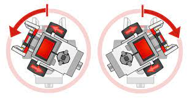

# Point turn of a vehicle

## Introduction
An object is said to have done a point turn if it rotates about an axis passing through the centre of the object.
The earth rotating about its axis can be considered to be point turn.

</br>
<p align="center">
  
</p>
</br>

Here we have built a bot controlled by an arduino on-board to make a point turn.
Here we are using point turn to change the direction that our arduino bot is facing so as to make a quick turn.

</br>
<p align="center">
  
</p>
</br>

## Working
An android app is used here to send commands over to the arduino using bluetooth interface with the help of a bluetooth module connected to the arduino.We will not going into the details of the android app as it will be discussed in a later project.
</br>
Here we are simply writing the code for a point turn and wil be observing the point turn action of the bot.

## Code
Code used to program the arduino
<details>
<summary>Click to expand code...</summary>
<p>

```c++
int botSpeed = 100;

void setup() {
  // setting PWM output pins for direction and speed control of dc motors
  pinMode(5,OUTPUT);
  pinMode(6,OUTPUT);
  Serial.begin(9600); // Communication rate of the Bluetooth Module
}

void loop() {
  // give pwm signals to respective digital pins to perform point turn

  // turn left wheels forward
  analogWrite(5,botSpeed);
  // turn right wheels backward
  analogWrite(6,botSpeed);
}
```

</p>
</details>
